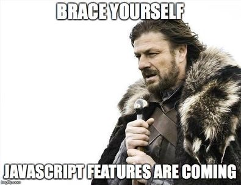

## Why Babel?

* Previously, I used CDN links to bring ThreeJS to my projects. One day, they stopped working... 😂
* Github Pages is a static file host, so no processing is done.
* Imports vs Requires?

